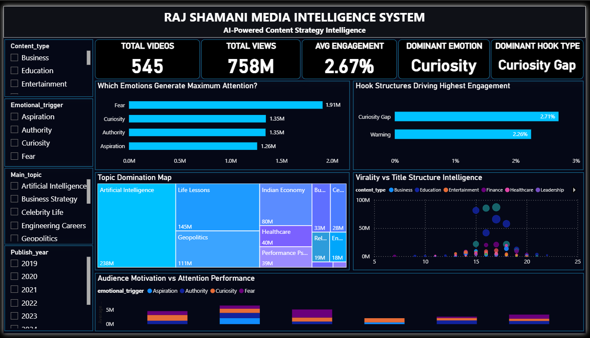
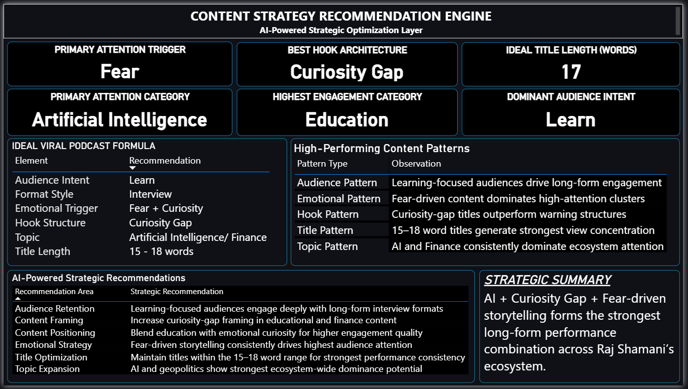

# 🚀 AI-Powered Creator Intelligence System

> Reverse-engineering long-form content performance using Python, YouTube Data API, Claude AI, and Power BI — across 545+ videos from one of India's largest podcast ecosystems.

---

## 📌 Project Overview

I analyzed **545+ Raj Shamani videos** to understand what actually drives long-form content performance.

This project combines:

- Python automation
- YouTube Data API v3 extraction
- AI-assisted classification (Claude AI)
- Power BI intelligence dashboards
- Strategic recommendation modeling

The goal was not to build another analytics dashboard.

The goal was to reverse-engineer:
- virality mechanics
- audience psychology
- emotional trigger patterns
- hook structures
- title engineering
- and high-performing content formulas

The result is a complete **Creator Intelligence System** capable of surfacing strategic insights from one of India's largest long-form podcast ecosystems.

---

## 🖼️ Dashboard Preview

### Page 1 — Creator Intelligence System




---

### Page 2 — Strategic Recommendation Engine




---

## 📊 Channel Intelligence Captured

| Metric | Value |
|---|---|
| Videos Analyzed | 545+ |
| Total Views | 758M+ |
| Average Views per Video | 1.39M |
| Highest Viewed Video | 36M views |
| Average Video Duration | 76.5 Minutes |
| Analysis Timeline | 2019–2026 |

---

## 🏗️ System Architecture

```text
YouTube Data API v3
        │
        ▼
youtube_extractor.py          ← Fetches all videos, filters < 10 min
        │
        ▼
raj_shamani_longform_videos.xlsx  ← Raw dataset (545 videos × 9 columns)
        │
        ▼
Claude AI (Batch Classification)  ← Classifies titles across 8 dimensions
        │
        ▼
raj_shamani_ai_classified.xlsx    ← Enriched dataset (545 videos × 17 columns)
        │
        ▼
RSMIS.pbix                        ← Power BI Intelligence Dashboard
        │
        ▼
Strategic Recommendation Engine
```

---

## 📁 Repository Structure

```text
RSMIS/
├── 📄 youtube_extractor.py               # Data pipeline: YouTube API → Excel
├── 📊 raj_shamani_longform_videos.xlsx   # Raw extracted video data
├── 🧠 raj_shamani_ai_classified.xlsx     # AI-enriched classified dataset
├── 📈 RSMIS.pbix                         # Power BI dashboard
└── 📘 README.md
```

---

## ⚙️ How the System Works

### Step 1 — YouTube Data Extraction

`youtube_extractor.py` uses the **YouTube Data API v3** to:

1. Search for the Raj Shamani channel and retrieve its `channel_id`
2. Fetch the channel's full uploads playlist
3. Loop through all videos and extract `snippet`, `statistics`, and `contentDetails`
4. Parse ISO 8601 duration strings (`PT2H1M35S`) into total minutes
5. Filter out videos under 10 minutes (Shorts, clips, promos)
6. Export structured data to Excel

**Extracted Fields:**

| Column | Description |
|---|---|
| `video_id` | YouTube video ID |
| `title` | Full video title |
| `published_at` | Upload timestamp (ISO 8601) |
| `views` | Total view count |
| `likes` | Total like count |
| `comments` | Total comment count |
| `duration` | Raw ISO 8601 duration string |
| `duration_minutes` | Duration parsed into minutes |
| `video_url` | Full YouTube URL |

---

### Step 2 — AI-Assisted Classification

Every video title was passed through **Claude AI** for zero-shot classification across **8 strategic dimensions** — no manual labeling required.

| Dimension | What It Captures | Example Values |
|---|---|---|
| `content_type` | Broad content category | Education, Finance, Technology, Healthcare |
| `main_topic` | Specific subject | Indian Economy, Leadership, Engineering Careers |
| `emotional_trigger` | Primary emotion activated | Curiosity, Fear, Aspiration, Authority |
| `hook_type` | Opening hook mechanism | Curiosity Gap, Warning |
| `title_style` | Title structural pattern | Statement, Number-based, Interview, How-to, Question |
| `audience_intent` | Viewer motivation | Financial Growth, Learn, Entertainment |
| `virality_potential` | Predicted shareability | High, Medium, Low |
| `guest_industry` | Guest's professional background | Economist, Doctor, Sports, Educator |

---

### Step 3 — Power BI Intelligence System

The dashboard (`RSMIS.pbix`) transforms raw YouTube metadata into a multi-layer intelligence system with filters for date range, content type, and virality potential.

---

## 📊 Intelligence Layers Built

### 🎯 Attention Psychology Engine
Maps which emotional triggers generate the highest audience attention and view concentration.

### 🪝 Hook Structure Intelligence
Tracks how curiosity-gap framing outperforms warning-based hooks across the entire video catalog.

### 🧠 Topic Domination Mapping
Visualizes ecosystem-wide attention across AI, finance, education, and geopolitics.

### 📈 Virality vs Title Engineering
Identifies how title structure and word count influence content performance.

### 👥 Audience Intent Intelligence
Maps why audiences consume long-form content: learning, entertainment, financial growth, self-improvement.

### 🤖 Strategic Recommendation Engine
Generates content optimization insights based on discovered performance patterns.

---

## 🔍 Key Strategic Findings

### Content Mix

The channel spans 10 content categories. Education and Technology dominate:

| Content Type | Videos |
|---|---|
| Education | 182 |
| Technology | 149 |
| Finance | 63 |
| Business | 38 |
| Entertainment | 34 |
| Self Improvement | 33 |
| Healthcare | 25 |
| Psychology | 16 |

---

### Hook Strategy

- **91.6%** of titles use a **Curiosity Gap** hook
- **8.4%** use a **Warning** hook
- No videos rely on clickbait questions or unsubstantiated hype

---

### Emotional Triggers

| Trigger | Videos | Share |
|---|---|---|
| Curiosity | 428 | 78.5% |
| Fear | 46 | 8.4% |
| Authority | 46 | 8.4% |
| Aspiration | 25 | 4.6% |

---

### Title Formats

| Format | Videos | Share |
|---|---|---|
| Statement | 207 | 38% |
| Number-based | 186 | 34% |
| Interview | 75 | 14% |
| How-to | 44 | 8% |
| Question | 33 | 6% |

---

### Audience Intent

| Intent | Videos |
|---|---|
| Financial Growth | 212 |
| Learn | 199 |
| Startup Learning | 38 |
| Self Improvement | 37 |

---

### Top Performing Videos

| Views | Title |
|---|---|
| 36M | Khan Sir Podcast: India vs China, Pakistan, Bihar's Reality & Geopolitics |
| 30.4M | Vijay Mallya Podcast: Rise & Downfall Of Kingfisher Airlines |
| 27.2M | Indian Spy: Dark Reality China, Weapons, Commando Training & Jail |
| 14.3M | Dr. Cuterus on Sexual Health, Orgasm, G-Spot & Infertility |
| 13.7M | Khan Sir on World War 3, India vs Pakistan, China, Trump & Epstein |

---

### Title Engineering

High-performing titles consistently clustered within the **15–18 word range**. Statement and number-based formats dominated the top-performing tier.

---

## 🧠 Ideal Viral Podcast Formula

| Element | Recommendation |
|---|---|
| Topic | AI / Finance / Geopolitics |
| Emotional Trigger | Fear + Curiosity |
| Hook Structure | Curiosity Gap |
| Title Length | 15–18 Words |
| Title Format | Statement or Number-based |
| Audience Intent | Learn / Financial Growth |
| Format Style | Interview |

---

## 🚀 Getting Started

### Prerequisites

```bash
pip install google-api-python-client pandas openpyxl
```

### Clone the Repository

```bash
git clone https://github.com/yourusername/RSMIS.git
cd RSMIS
```

### Add YouTube API Key

Inside `youtube_extractor.py`:

```python
API_KEY = "YOUR_API_KEY_HERE"
```

> 💡 Get a free YouTube Data API v3 key from [Google Cloud Console](https://console.cloud.google.com/)

### Run Extraction Pipeline

```bash
python youtube_extractor.py
```

### Open Dashboard

Open `RSMIS.pbix` in **Power BI Desktop** (free download from Microsoft).

---

## 🔧 Configuration

In `youtube_extractor.py`, you can modify:

```python
# Minimum video length to include (default: 10 minutes)
if total_minutes < 10:
    continue

# Change target channel
q = "Raj Shamani"  # Replace with any creator name
```

---

## 📦 Dataset Schema

**`raj_shamani_ai_classified.xlsx`** — full enriched dataset with **17 columns × 545 rows**.

All AI classification was performed zero-shot on video titles only. No manual labeling was required.

---

## 🛠️ Tech Stack

| Tool | Purpose |
|---|---|
| Python 3 | Data extraction & automation |
| YouTube Data API v3 | Video metadata source |
| `google-api-python-client` | YouTube API wrapper |
| `pandas` | Data manipulation & processing |
| `openpyxl` | Excel export |
| Claude AI | Zero-shot content classification |
| Power BI | Intelligence dashboard & visualization |

---

## 💡 Future Improvements

- [ ] Thumbnail intelligence analysis (color, face detection, text overlay)
- [ ] View velocity tracking (views per day since upload)
- [ ] NLP on video titles (keyword frequency, bigrams)
- [ ] Comment sentiment analysis
- [ ] Competitor channel comparison (Nikhil Kamath, Ankur Warikoo)
- [ ] Automated weekly data refresh via GitHub Actions
- [ ] AI-generated content recommendations
- [ ] Retention pattern prediction

---

## 📄 License

MIT License. Use freely, attribution appreciated.

---

## 🙌 Acknowledgements

Built as a strategic content intelligence study on one of India's most consistent long-form YouTube creators. All data sourced via the official YouTube Data API v3.
